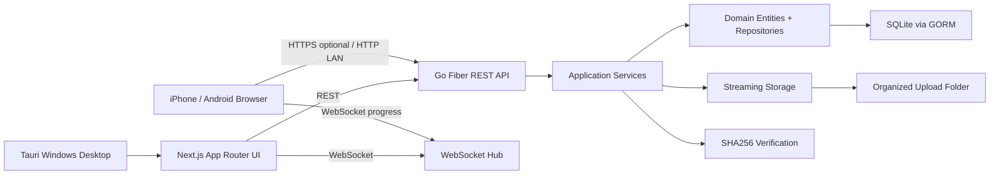
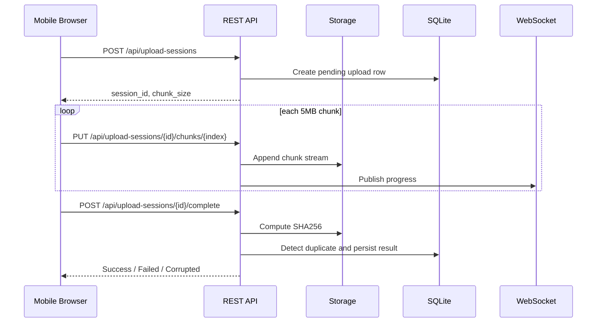

# PhotoTransfer LAN Architecture

## System Overview

## Clean Architecture Boundaries

- `domain`: core entities, repository interfaces, upload statuses, domain errors.
- `application`: use cases such as first setup, authentication, upload session creation, chunk append, verification, duplicate handling.
- `infrastructure`: SQLite/GORM repositories, file storage, hashing, settings persistence.
- `presentation`: Fiber REST handlers, middleware, Swagger, WebSocket hub.
- `frontend`: Next.js desktop dashboard and mobile upload UI.
- `src-tauri`: Windows desktop shell, process bootstrap, installer config.

## Upload Sequence

## Security Model

- Passwords are stored with bcrypt hashes only.
- Browser sessions use secure, httpOnly cookies when HTTPS is enabled.
- CSRF token is required for mutating browser requests.
- Rate limiting protects login and upload-session endpoints.
- Temporary QR token can be generated for short-lived mobile upload access.
- Auto logout is controlled by `settings.session_timeout_minutes`.

